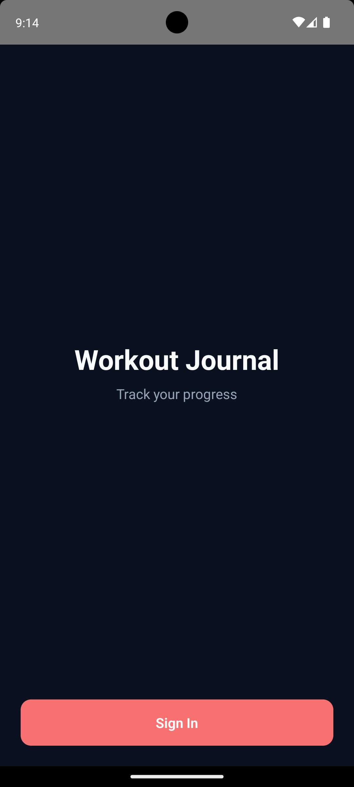
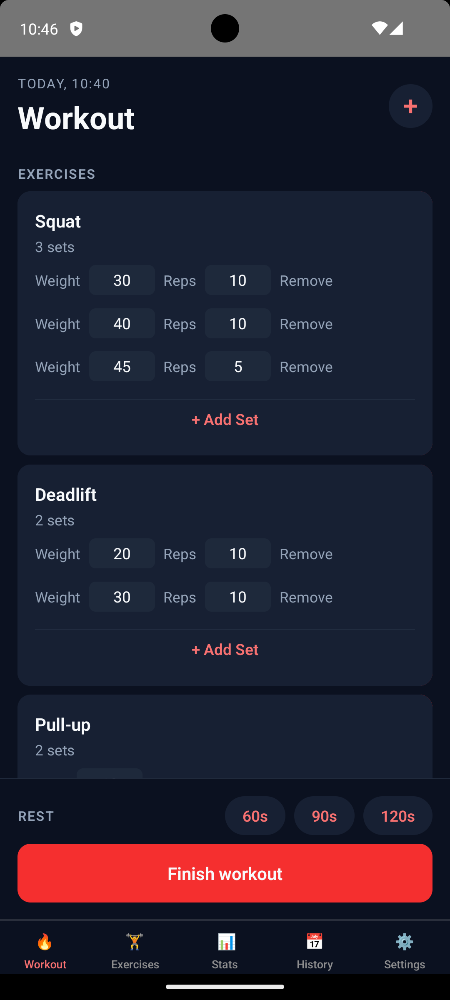
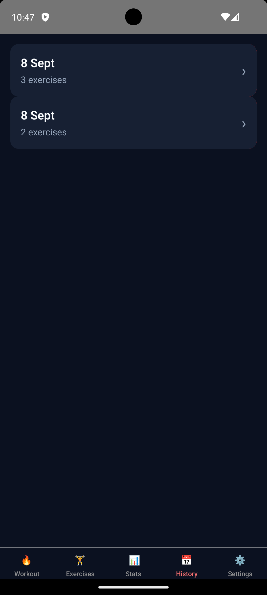
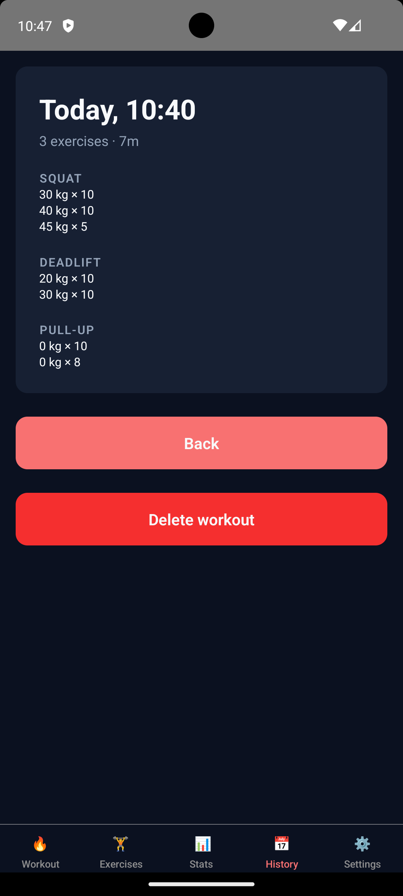
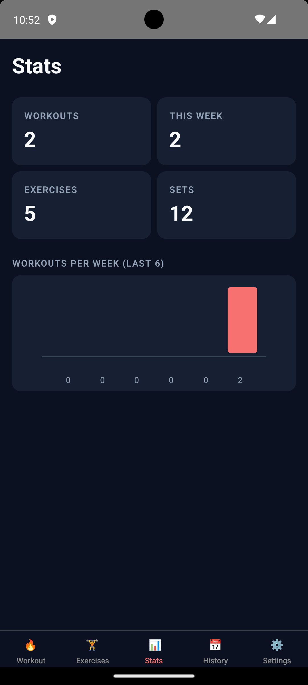

# Workout Journal

A minimalist strength-training tracker built with modern React Native. Log workouts, track sets and reps, and see your history — all offline-first, with a dark theme and native-feeling gestures.


## Screenshots

| Sign in                                 | Workout                                  | History                                  | Detail                                 | Stats                                |
| --------------------------------------- | ---------------------------------------- | ---------------------------------------- | -------------------------------------- | ------------------------------------ |
|  |  |  |  |  |

## Try it

[Download the latest Android APK](https://github.com/ymanfryd/WorkoutJournal/releases/latest/download/WorkoutJournal.apk) (arm64/armv7 only).

Or grab any version from [Releases](https://github.com/ymanfryd/WorkoutJournal/releases).

## What it does

- **Start a workout** from the Workout tab — creates an empty active workout.
- **Add exercises** from a curated library or your own custom ones.
- **Log sets** — weight × reps, mark completed, delete individual sets.
- **Finish workout** — captures duration, moves to History.
- **Browse history** — swipe left on any workout to delete, tap for full breakdown.
- **Manage exercises** — 10 preset exercises + your own custom ones, grouped by muscle.
- **Haptic feedback** — via a custom TurboModule, real vibration on gestures and timer end.
- **Rest timer** — quick presets (60/90/120s) with a Skia progress ring and haptic notification when done.
- **Stats** — total workouts, weekly count, exercises and sets, plus a Skia bar chart of workouts per week.

Data is persisted locally with MMKV. No backend required.

## Tech stack

This project was built as a hands-on tour of the modern React Native ecosystem. Highlights:

**Core**

- React Native `0.85.3` (bare CLI, no Expo)
- New Architecture (Bridgeless, Fabric, Hermes V1) enabled by default
- React `19.2.3` + React Compiler (automatic memoization)
- TypeScript `5.8` strict mode with path aliases

**Navigation**

- React Navigation v7 with the **Static API**
- Native Stack + Bottom Tabs, nested navigators, modal presentation
- Switching pattern for auth via `groups` + `if` hooks
- Deep linking with custom URL scheme (`workoutjournal://`)

**State**

- **TanStack Query** for server state (workouts, exercises)
- **Zustand** + persist for auth, with **MMKV** as the sync storage backend
- Correct query key hygiene and mutation invalidations throughout

**UI / Interactivity**

- **Reanimated 4** + `react-native-worklets` for UI-thread animations
- **Gesture Handler v3** (hook-based API) for swipe-to-delete, tap composition
- **Skia** for the rest timer's progress ring and the weekly bar chart on Stats
- **FlashList v2** for virtualized lists

**Native modules (custom TurboModules)**

- `AppInfo` — reads bundle version and identifier natively
- `Haptics` — cross-platform haptic feedback via `UIImpactFeedbackGenerator` (iOS) and `Vibrator` API with waveform patterns (Android)

**Build & CI**

- **Fastlane** with lanes for iOS and Android debug/release builds
- **GitHub Actions** running lint + type-check on every PR

**Tests**

- **Jest** + **React Native Testing Library** for component tests
- **Maestro** for end-to-end flows (login, create workout)

## Requirements

- macOS with **Xcode 26+**
- **Android Studio** with SDK 36 and NDK 27
- **Node 22+**
- **JDK 17** (`brew install openjdk@17`)
- **Ruby 3.3+** with `bundler` (for `pod install`)
- Physical device recommended for haptic testing (simulators don't vibrate)

## Getting started

```bash
# 1. Install JS dependencies
npm install

# 2. Install iOS pods
cd ios
bundle install
bundle exec pod install
cd ..

# 3. Run
npm run android   # or npm run ios
```

On some setups Xcode 26 writes `objectVersion = 70` to the Xcode project, which the current `xcodeproj` gem doesn't fully support. If `pod install` fails with that error, downgrade the version in `ios/WorkoutJournal.xcodeproj/project.pbxproj` to `56` before running `pod install`, then let Xcode upgrade it back on open.

## Testing

```bash
npm test                       # Jest unit + component tests
maestro test .maestro/         # E2E flows (requires simulator with app installed)
```

## Project structure

```
src/
├── api/           # data-layer functions (pure async, MMKV-backed)
├── components/    # reusable UI
├── haptics/       # public wrapper over Haptics TurboModule
├── hooks/         # TanStack Query hooks
├── navigation/    # RootStack, RootTabs, HistoryStack
├── screens/       # feature screens
├── specs/         # TurboModule TS specs (Codegen input)
├── stores/        # Zustand stores
├── storage/       # MMKV singleton
├── theme/         # design tokens (dark theme)
├── types/         # global type augmentations
└── utils/         # small helpers
```

Native code lives in:

- `android/app/src/main/java/com/workoutjournal/modules/` — Kotlin modules
- `ios/modules/` — Obj-C++ modules

## Known limitations

Honest list of what's rough or unfinished:

- **Time-based exercises** (plank, hold) reuse the `reps` field as seconds. A proper `measurementType` field on `Exercise` would be cleaner but touches models, forms, and rendering.
- **Auth is mocked** — Sign In toggles a flag, no real backend or credentials.
- **Deep-link cold-start with a logged-out user** may not always resume to the requested screen after sign-in.
- **`ExerciseCard` in WorkoutDetail** currently reuses the library card; a lighter read-only variant would be cleaner.

## Notes on the build

The project intentionally uses the newest RN 0.85 defaults (Bridgeless, Fabric, JSI-only) rather than legacy fallbacks. That surfaces some rough edges in the ecosystem — `react-native-mmkv` v4 pulls in `react-native-nitro-modules`, Reanimated 4 splits worklets into a separate package, Gesture Handler v3 deprecates the old builder API. All of it is documented in code and in the git history.

## License

MIT — do whatever you want with it.
